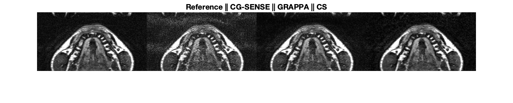

# MRI Image Reconstruction 
This is a tutorial of MRI reconstructions including CG-SENSE, GRAPPA, compressed sensing and image enhacement using deep learning.
To run this code, please use basic_MRI_recon.m

RO:       # of readout lines,
PE:       # of phase encode lines,
NO_C:     # of coil elements,

Input data:
- kspace (RO x PE x NO_C)
- maps (RO x PE x NO_C)

